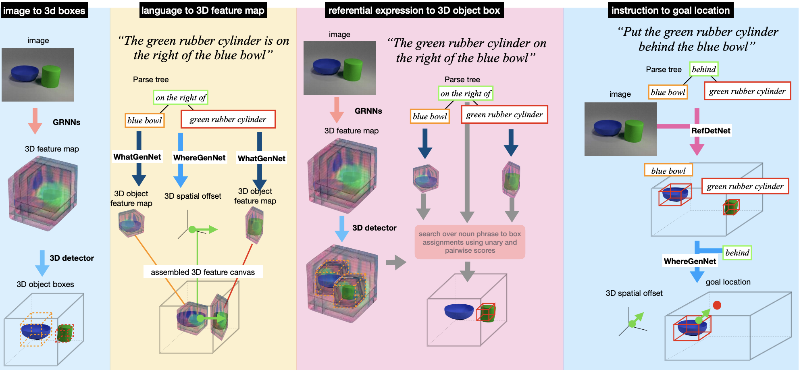
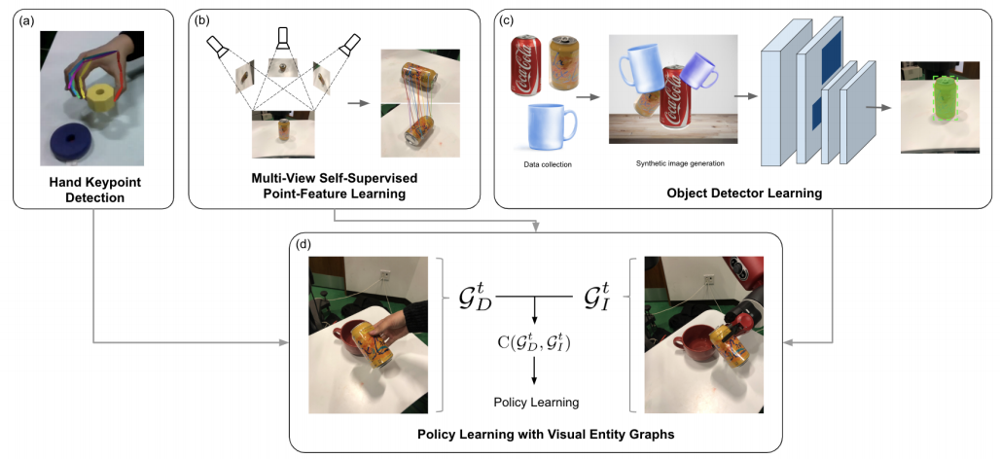
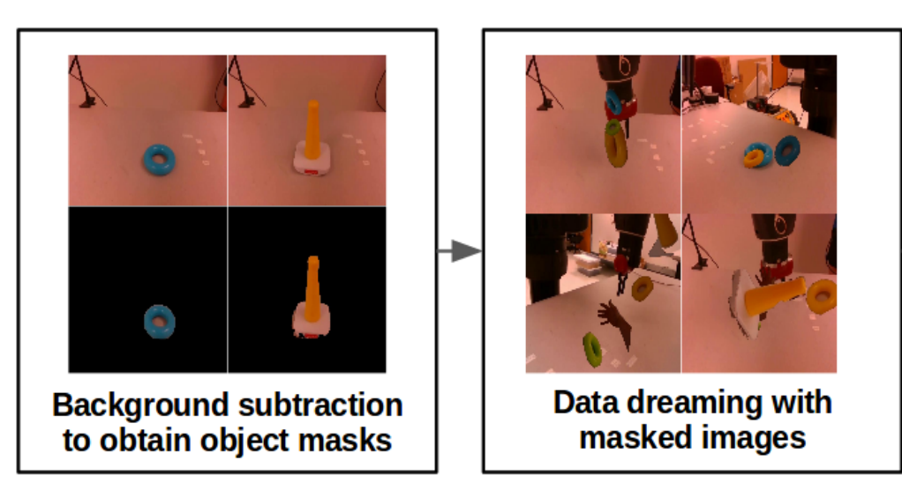

## Hello!
I am Max, and I am currently working on computer vision and reinforcement & imitation learning for robot manipulation at *Covariant*.
I recently graduated from the MSR program at the Robotics Institute at Carnegie Mellon University, where I was glad to have been co-advised by Prof. Katerina Fragkiadaki & Prof. Oliver Kroemer. 

My research is motivated by enabling robots to learn complex skills by leveraging computer vision & human demonstrations. I mostly focus on visual imitation learning and model-based reinforcement learning.

### Publications
#### [Embodied Language Grounding with Implicit 3D Visual Feature Representations](https://mihirp1998.github.io/project_pages/emblang/)
Mihir Prabhudesai, Hsiao-Yu Fish Tung, Syed Ashar Javed, **Maximilian Sieb**, Adam W. Harley , Katerina Fragkiadaki.
*IEEE Conference on Computer Vision and Pattern Recognition (CVPR)*.
Seattle, USA, June 2020.

In this [paper](http://openaccess.thecvf.com/content_CVPR_2020/papers/Prabhudesai_Embodied_Language_Grounding_With_3D_Visual_Feature_Representations_CVPR_2020_paper.pdf), we propose a computational model of simulation semantics that associate language utterances to 3D visual abstractions of the scene they describe. We encode the visual abstractions via 3-dimensional visual feature maps that we obtain via view prediction from different RGB images of the scene in a self-supervised manner.

#### [Graph-Structured Visual Imitation](https://msieb1.github.io/visual-entity-graphs/)
**Maximilian Sieb**, Zhou Xian, Audrey Huang, Oliver Kroemer, Katerina Fragkiadaki.
*Conference on Robot Learning (CoRL)*. 
Osaka, Japan, November 2019. 
Spotlight presentation ([slides](pdf/corl_presentation.pdf)).

In this [paper](https://arxiv.org/pdf/1907.05518), we propose a graph-structured state representation for visual imitation learning. We show how we can leverage different visual entities of various granularities to obtain a state representation that can be used for reinforcement learning to learn manipulation skills within a few minutes of real-life policy rollouts.

#### [Data Dreaming for Object Detection: Learning Object-Centric State Representations for Visual Imitation](http://www.cs.columbia.edu/~allen/S19/Student_Papers/fragiadaki_object_mask.pdf) 
**Maximilian Sieb**, Katerina Fragkiadaki.
*IEEE-RAS 18th International Conference on Humanoid Robots (Humanoids)*.
Beijing, China, November, 2018. 
Oral presentation ([slides](pdf/humanoids_presentation.pdf)).

In this paper, we show how we can use synthetically generated image data from only a few background-subtracted ground-truth images to build instance-specific object detectors robust to partial occlusions. Further, we demonstrate how we can use these detectors to imitate human demonstrations of manipulation tasks in a sample-efficient manner, where the overall imitation learning process takes less than 10 minutes.

#### [Probabilistic Trajectory Segmentation by Means of Hierarchical Dirichlet Process Switching Linear Dynamical Systems](https://arxiv.org/pdf/1806.06063.pdf)
**Maximilian Sieb**, Matthias Schultheis, Sebastian Szelag, Rudolf Lioutikov, Jan Peters.
*arXiv:1806.06063*. May, 2018.

This work is about inferring dynamical modes of a given trajectory in a non-parametric fashion. Simply said, the algorithm tries to fit multiple linear segments within the trajectory where the number of fitted segments does not have to specified, but is inferred as well by using a non-parametric dirichlet prior ([code](https://github.com/msieb1/switching-linear-dynamical-systems)).

### Patents
#### [Identifying scene correspondences with neural networks](https://patentimages.storage.googleapis.com/fe/60/5f/cec7d7ac8f498e/US20210233258A1.pdf) 
The idea here is the following: We have a bin from which we wish to pick items. For every pick, we want to avoid picking items which we have failed to pick before. However, because items in the bin might move around between subsequent picks, it is not obvious how to correlate objects across different picks to keep track of the failure count. In this work, we introduce a deep learning based approach to predict correspondences of objects given two scenes.

### Selected Projects
#### [Master Thesis: Visual Imitation Learning for Robot Manipulation](pdf/MSR_thesis_final.pdf)

I have recently obtained my Master's degree in Robotics, and my Master's thesis on Visual Imitation Learning for Robot Manipulation can be found on the official CMU website via [this]( https://www.ri.cmu.edu/publications/visual-imitation-learning-for-robot-manipulation/) link.

#### [Aligning Word Embeddings of Different Languages within a Shared Embedding Space](pdf/aligning-word-embeddings.pdf)
Learning translations between different languages has drawn a lot of focus recently. In this work, we examined how we can leverage shared embedding spaces of different languages to learn better translations overall. Do multilingual people "think" by subconsciously translating each language into a common embedding space, or is each language pair individually translated, i.e., our mind has a set dictionary for each translation pair? This project is motivated by this line of thinking: the key reasoning here is that different language translations could be thought of operating in an embedding space in which all languages can be embedded to some extent. Ideally, this would improve translation between language pairs by leveraging knowledge of multiple dictionaries which is encoded in the shared embedding space. 

      
#### [Bachelor Thesis: Design and Analysis of a Ball-Balancing Plate](pdf/bachelor_thesis.pdf)

This thesis revolves around the design of a ball-balancing plate and the anaylsis & implementation of different control algorithms. The thesis describes the entire design process: The CAD-design of the contraption, the dynamical & mechanical analysis, the control design & analysis, the microcontroller implementation, and experimental verification.

